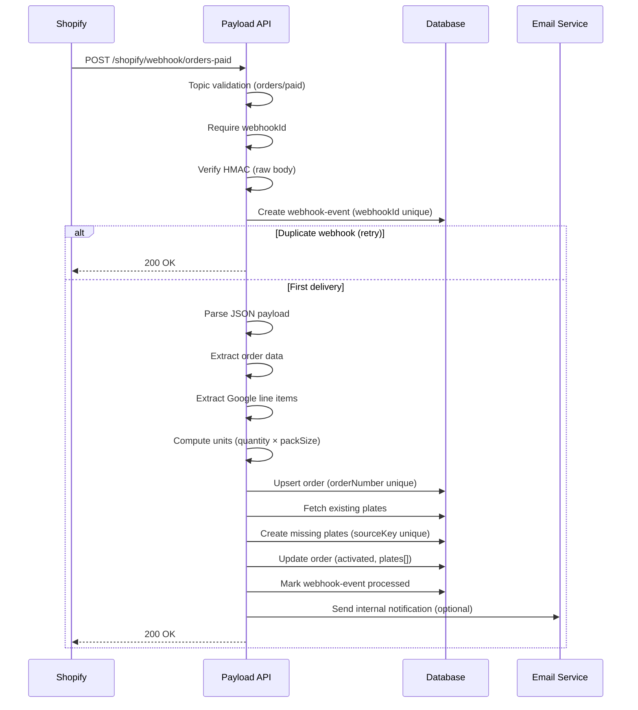

# Architecture

This document describes the architecture of the Shopify → Payload pipeline used
to generate NFC plates after a successful payment.

The goal of this system is to be:
- **Secure**
- **Idempotent**
- **Resilient to retries and concurrency**
- **Observable in production**

---

## Overview

When a customer completes a payment on Shopify:

1. Shopify sends an `orders/paid` webhook
2. The Payload backend verifies the request authenticity
3. The webhook delivery is persisted to prevent replay
4. The order is created or updated idempotently
5. The correct number of NFC plates is generated
6. Optional internal notifications are sent
7. Shopify receives a `200 OK` response and stops retrying

---

## High-level flow



## Components

### Shopify

- Source of truth for orders and payments
- Triggers webhooks for lifecycle events
- Automatically retries webhook deliveries on timeout or non-2xx responses
- Only evaluates the HTTP status code (response body is ignored)

### Payload API (Webhook endpoint)

The webhook endpoint is responsible for:

- Validating required headers (`topic`, `webhookId`, `hmac`)
- Verifying request authenticity via HMAC SHA-256
- Persisting webhook deliveries to prevent replay
- Performing all business logic idempotently
- Returning a minimal success response to Shopify

The endpoint is designed to be **side-effect safe**:  
re-running it must never create duplicates.

### Database (Payload collections)

#### `orders`

- Represents a Shopify order
- Idempotent by `orderNumber` (unique index)
- Can be safely upserted on every webhook delivery
- Acts as the aggregate root for generated plates

#### `plates`

- Represents a physical NFC plate
- Publicly accessible via `/p/:slug`
- Idempotent by deterministic `sourceKey` (unique index)
- `slug` is used only for public access, not idempotency

#### `webhook-events`

- Stores each webhook delivery
- Enforces anti-replay via `webhookId` unique index
- Provides observability, debugging and auditability
- Can be safely purged after a retention period

### Email service

- Used for internal notifications only
- Triggered when new plates are created
- Must never affect webhook delivery success
- Failures are logged but ignored by the webhook flow

---

## Security model

### Webhook authenticity

- Shopify signs each webhook request using a shared secret
- The signature is validated against the **raw request body**
- Prevents forged or tampered requests

### Anti-replay protection

- Each webhook delivery has a unique `webhookId`
- The system persists it **before** doing any business logic
- Duplicate deliveries are detected at the database level
- Duplicate deliveries return `200 OK` immediately

---

## Idempotency strategy

### Orders

- Orders are idempotent by `orderNumber`
- Re-processing the same order updates the same record
- Guarantees a single order per Shopify purchase

### Plates

Plates are generated using a deterministic idempotency key:

```bash
sourceKey = ${orderNumber}|${lineItemId}|${index}
```
This guarantees:

- No duplicate plates on webhook retries
- No duplicate plates under concurrent executions
- Safe "create if missing" behavior without locks

A **unique database index** enforces this invariant.

---

## Failure handling

Shopify retries webhooks automatically unless it receives a `2xx` response.

This system differentiates between:

### Permanent errors (payload-level)

Examples:
- Invalid JSON body
- Missing required fields
- Unsupported pack size
- Invalid Google review URL

Handling:
- Mark the `webhook-event` as `failed`
- Return `200 OK` to stop retries

These errors cannot be fixed by retrying.

---

### Transient errors (infrastructure-level)

Examples:
- Database unavailable
- Misconfigured secrets
- Unexpected runtime failures

Handling:
- Return non-2xx (e.g. `500`)
- Shopify retries automatically later

---

## Observability & retention

- All webhook deliveries are persisted in `webhook-events`
- Status transitions: `received → processed | failed`
- Enables support audits and debugging
- Old finalized events can be purged after a retention window (e.g. 30 days)

---

## Design goals recap

- Correctness over convenience
- Idempotency by construction
- Safe retries and concurrency
- Minimal external assumptions
- Production-grade observability
